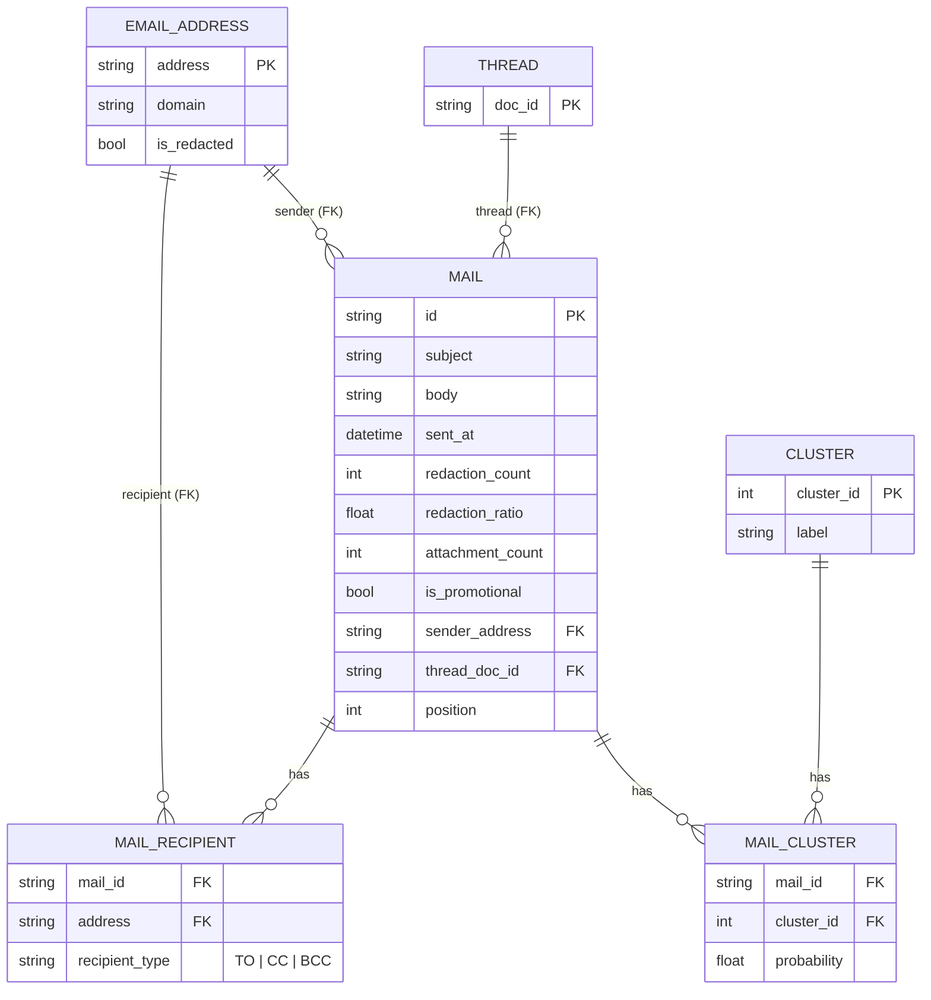

# Diagramma — Modello ER relazionale del dataset sorgente

Come si modellerebbe il dataset `.parquet` in forma relazionale, prima della
mappatura a grafo. Nessuna entità `Person`: solo indirizzi email e display
name testuali (vedi "Derivazione di `Person`" in `graph_schema.md`).

Le tabelle ponte (`MAIL_RECIPIENT`, `MAIL_CLUSTER`) esistono solo dove la
relazione è realmente N:M (una mail ha più destinatari, un destinatario
riceve più mail; una mail può appartenere a più cluster con probabilità
diverse). Il legame `Mail`-`Thread` è invece N:1 (ogni mail ha un solo
`doc_id` e un solo `message_index`, vedi `src/etl/build_csv.py`): niente
tabella ponte, `thread_doc_id` (FK) e `position` sono colonne dirette di
`MAIL`, come già `sender_address`.

