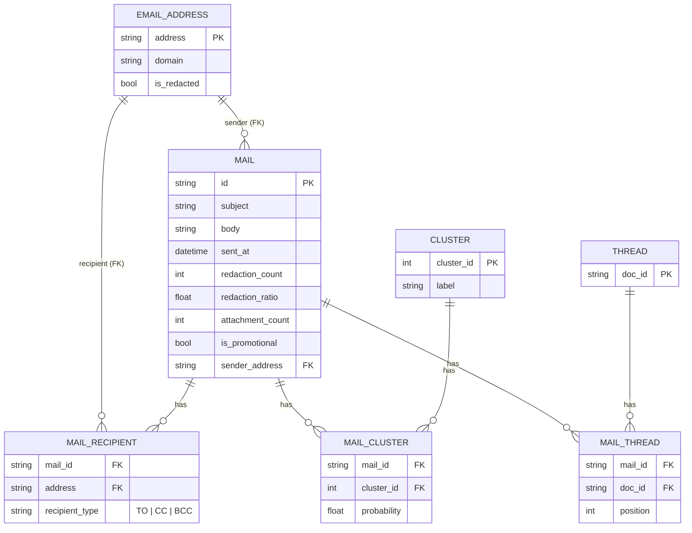

# Diagramma — Modello ER relazionale del dataset sorgente

Come si modellerebbe il dataset `.parquet` in forma relazionale, prima della
mappatura a grafo. Nessuna entità `Person`: solo indirizzi email e display
name testuali (vedi "Derivazione di `Person`" in `graph_schema.md`).

