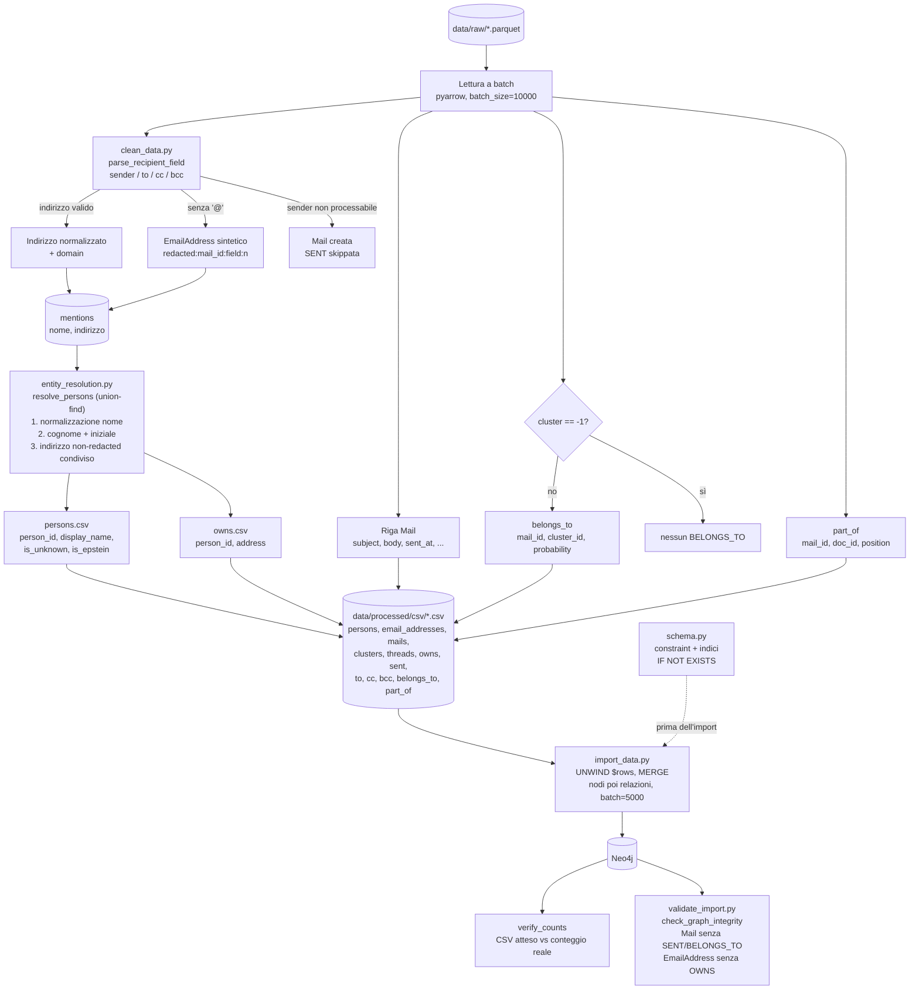

# Diagramma — Pipeline ETL

```mermaid
flowchart TD
    Parquet[("data/raw/*.parquet")] --> Batch["Lettura a batch
pyarrow, batch_size=10000"]

    Batch --> Parse["clean_data.py
parse_recipient_field
sender / to / cc / bcc"]

    Parse -->|indirizzo valido| Addr["Indirizzo normalizzato
+ domain"]
    Parse -->|senza '@'| Redacted["EmailAddress sintetico
redacted:mail_id:field:n"]
    Parse -->|sender non processabile| SkipSent["Mail creata
SENT skippata"]

    Addr --> Mentions[("mentions
nome, indirizzo")]
    Redacted --> Mentions

    Batch --> MailRow["Riga Mail
subject, body, sent_at, ..."]
    Batch --> ClusterRow{"cluster == -1?"}
    ClusterRow -->|no| BelongsTo["belongs_to
mail_id, cluster_id, probability"]
    ClusterRow -->|sì| NoCluster["nessun BELONGS_TO"]
    Batch --> ThreadRow["part_of
mail_id, doc_id, position"]

    Mentions --> Resolve["entity_resolution.py
resolve_persons (union-find)
1. normalizzazione nome
2. cognome + iniziale
3. indirizzo non-redacted condiviso"]
    Resolve --> Persons["persons.csv
person_id, display_name,
is_unknown, is_epstein"]
    Resolve --> Owns["owns.csv
person_id, address"]

    MailRow --> CSV[("data/processed/csv/*.csv
persons, email_addresses, mails,
clusters, threads, owns, sent,
to, cc, bcc, belongs_to, part_of")]
    Persons --> CSV
    Owns --> CSV
    BelongsTo --> CSV
    ThreadRow --> CSV

    CSV --> Import["import_data.py
UNWIND $rows, MERGE
nodi poi relazioni, batch=5000"]

    Schema["schema.py
constraint + indici
IF NOT EXISTS"] -.->|prima dell'import| Import

    Import --> Neo4j[("Neo4j")]

    Neo4j --> Verify["verify_counts
CSV atteso vs conteggio reale"]
    Neo4j --> Integrity["validate_import.py
check_graph_integrity
Mail senza SENT/BELONGS_TO
EmailAddress senza OWNS"]
```
