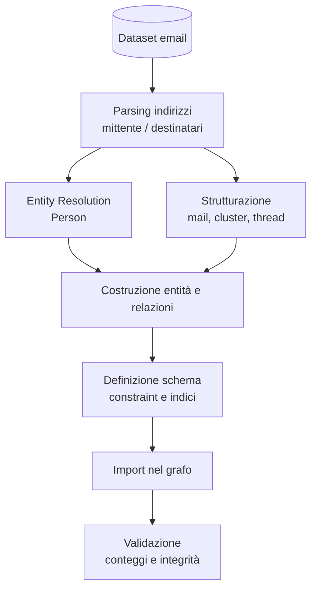

# Diagramma — Pipeline ETL (versione presentazione)

```mermaid
flowchart TD
    Source[("Dataset email")] --> Parsing["Parsing indirizzi
mittente / destinatari"]

    Parsing --> Resolution["Entity Resolution
Person"]
    Parsing --> Structuring["Strutturazione
mail, cluster, thread"]

    Resolution --> Build["Costruzione entità e relazioni"]
    Structuring --> Build

    Build --> Schema["Definizione schema
constraint e indici"]
    Schema --> Import["Import nel grafo"]

    Import --> Validation["Validazione
conteggi e integrità"]
```
