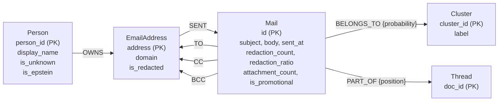

# Diagramma — Modello a grafo (Neo4j)

```mermaid
flowchart LR
    Person["Person
person_id (PK)
display_name
is_unknown
is_epstein"]
    EmailAddress["EmailAddress
address (PK)
domain
is_redacted"]
    Mail["Mail
id (PK)
subject, body, sent_at
redaction_count, redaction_ratio
attachment_count, is_promotional"]
    Cluster["Cluster
cluster_id (PK)
label"]
    Thread["Thread
doc_id (PK)"]

    Person -->|OWNS| EmailAddress
    EmailAddress -->|SENT| Mail
    Mail -->|TO| EmailAddress
    Mail -->|CC| EmailAddress
    Mail -->|BCC| EmailAddress
    Mail -->|"BELONGS_TO {probability}"| Cluster
    Mail -->|"PART_OF {position}"| Thread
```
