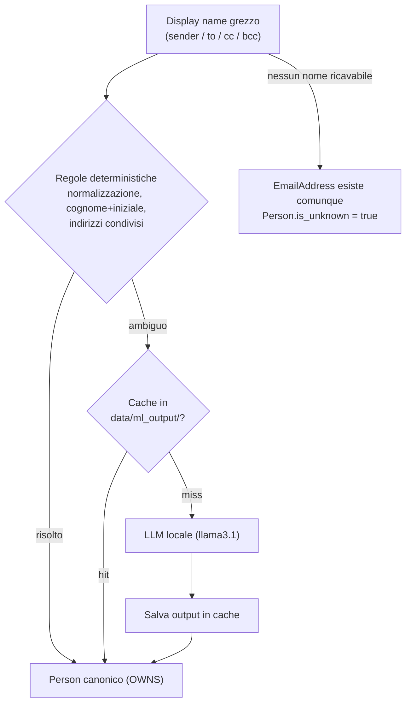

# Diagramma — Pipeline di risoluzione entità `Person`

```mermaid
flowchart TD
    Start["Display name grezzo
(sender / to / cc / bcc)"] --> Rules{"Regole deterministiche
normalizzazione, cognome+iniziale,
indirizzi condivisi"}
    Rules -->|risolto| PersonNode["Person canonico (OWNS)"]
    Rules -->|ambiguo| Cache{"Cache in
data/ml_output/?"}
    Cache -->|hit| PersonNode
    Cache -->|miss| LLM["LLM locale (llama3.1)"] --> Save["Salva output in cache"] --> PersonNode
    Start -->|nessun nome ricavabile| Unknown["EmailAddress esiste comunque
Person.is_unknown = true"]
```
